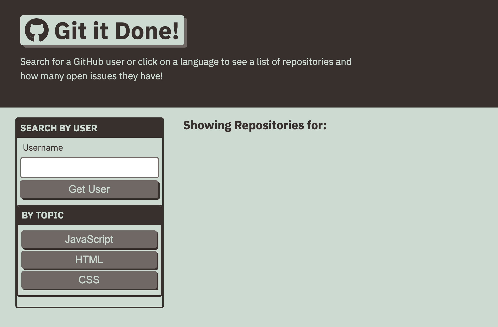

# git-it-done

## Description 
Git-It-Done is a website that allows a user to search GitHub for open source projects with open issues and pull request. This web app is built using HTML, CSS, JavaScript, Server-side APIs. 

## Deployment 
[Link](https://mariamv29.github.io/git-it-done/)

## Screenshot

---

🏆 
## Badges

## Contributing / Credits

[mariamv29](https://github.com/mariamv29/README-generator.git)